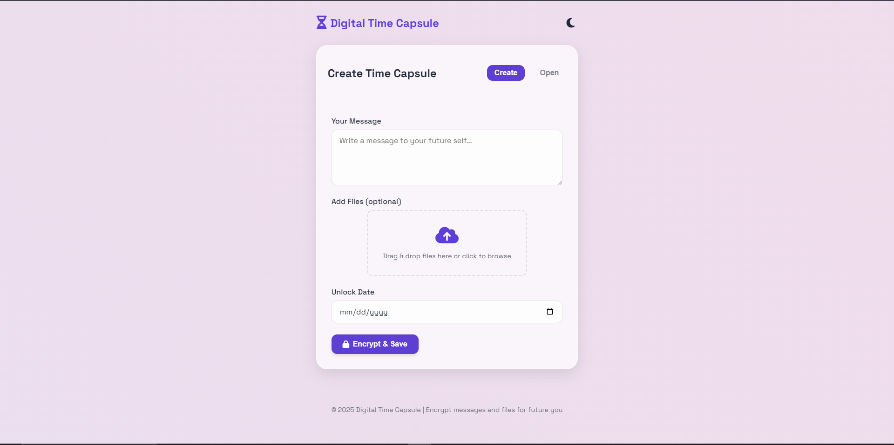

<!-- ASCII Art Header -->
<pre>
██████╗ ██╗████████╗██╗ ██████╗  █████╗ ██╗     ███████╗
██╔══██╗██║╚══██╔══╝██║██╔════╝ ██╔══██╗██║     ██╔════╝
██████╔╝██║   ██║   ██║██║  ███╗███████║██║     █████╗  
██╔═══╝ ██║   ██║   ██║██║   ██║██╔══██║██║     ██╔══╝  
██║     ██║   ██║   ██║╚██████╔╝██║  ██║███████╗███████╗
╚═╝     ╚═╝   ╚═╝   ╚═╝ ╚═════╝ ╚═╝  ╚═╝╚══════╝╚══════╝
</pre>

# 🚀 Digital Time Capsule: Encrypted Memories for the Next Era

---

*Imagine your memories, encrypted and glowing in the digital ether, awaiting their moment in time...*

---

## 🌠 Why Digital Time Capsule?

> **"The future belongs to those who encrypt their past."**

Preserve your thoughts, dreams, and files in a quantum-resistant vault.  
Let your memories travel through time, untouched, until you (or someone you trust) unlocks them.

---

## ✨ Feature Matrix

| 🚀 Feature             | 🛡️ Tech/Design        | 🌌 Description                              |
|-----------------------|----------------------|---------------------------------------------|
| **Quantum-Ready Encryption** | AES-GCM 256-bit (Web Crypto API) | Your data is sealed with future-proof cryptography. |
| **Time-Locked Capsules**     | Client-side Date Logic          | Messages and files are only accessible at your chosen future date. |
| **Glassmorphic + Neon UI**   | CSS, Animations, Font Awesome   | Futuristic, immersive, and touch-friendly design. |
| **Zero-Trust Architecture**  | 100% Client-Side                | No server, no tracking, no data leaks-ever. |
| **Drag & Drop Uploads**      | HTML5 File API                  | Effortless file handling for any format.    |
| **Dark/Light Adaptive**      | Auto & Manual Toggle            | Looks stunning in any environment.          |
| **Microinteractions**        | Animations, Feedback            | Every action feels alive and responsive.    |

---

## 🧬 How It Works

1. **Create Your Capsule**
    - Write a message and/or upload a file.
    - Set a future unlock date.
    - Encrypt and download your capsule + private key.

2. **Unlock the Future**
    - Upload your capsule file.
    - Enter your private key.
    - If the stars align (date reached), your secret is revealed.

---

## 🛠️ Tech Stack

- **Frontend:** HTML5, CSS3 (Glassmorphism + Neon), JavaScript (ES6+)
- **Encryption:** Web Crypto API (AES-GCM 256-bit)
- **UI/UX:** Responsive, animated, and mobile-first
- **Icons:** [Font Awesome 6](https://fontawesome.com/)
- **Fonts:** [Space Grotesk](https://fonts.google.com/specimen/Space+Grotesk)

---

## 🚀 Quickstart

- No installation needed!
- Just upload 'index.html' to any static host (GitHub Pages, Netlify, Vercel, Hostinger, etc.)

Or try the [🌐 Live Demo](#) *(https://hasanulhossaint.github.io/digital-time-capsule/)*

---

## 🧑‍🚀 Contribute to the Future

- Open issues for ideas, bugs, or feature requests.
- Fork and submit pull requests to make this tool even more advanced.

---

## 🧑‍💻 License

---

## 🌌 Acknowledgements

- Inspired by the timeless concept of time capsules, reimagined for the digital multiverse.
- Powered by [Font Awesome](https://fontawesome.com/) and [Space Grotesk](https://fonts.google.com/specimen/Space+Grotesk).

---

> **"Encrypt your story. Send it to the future. Let time be your messenger."**

---

